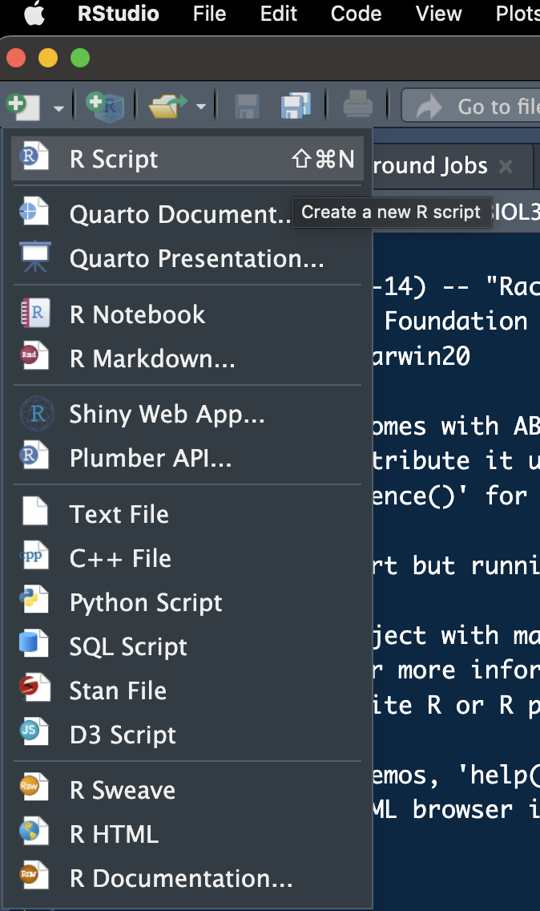
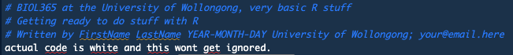

```{r libraryChunk, load-packages, include=FALSE}
# Markdown written by James B Dorey; contact jdorey@uow.edu.au (jbdorey@me.com) if help is needed.
# markdown packages
library(rmarkdown)
library(formatR)
library(styler)

# Load core packages
library(dplyr)

options(width = 60)
matrix(runif(100), ncol = 20)
demonstratorVersion = FALSE

```

`r if(demonstratorVersion == TRUE){"\\\n\n**THIS IS A DEMONSTRATOR ONLY VERSION**\\\n"}`

```{r secretRootPath, include=FALSE}
# Set the RootPath to the prac folder
RootPath <- "/Users/jamesdorey/Desktop/Uni/Teaching/BIOL361/Lectures/2025/Github_BIOL361_25/BIOL361_25/DoreyPrac1"
setwd(RootPath)
```

# Introduction to the *R* practicals

In BIOL361 I will take you through only two practicals, both based in R. If you've taken my other courses you may already know that I'm interested in giving you all a good knowledge of coding in R and how it's an extremely powerful tool for your careers. There may be some overlap and repetition, sorry in advance, but I want to make sure that everyone can jump in and start working on relatively even footing. 

1.  This prac will focus on teaching you some of the basics of R and RStudio, getting your workspace ready, reading in some data, a touch of data manipulation, and creating some simple plots.

2.  The second prac will focus on some basics of running geographic information systems (GIS) analyses in R. You may have already done some GIS work in **ArcMap** (which is an expensive and proprietary program that only works on PC) or **QGIS** (an open source program that works across PC, mac, and Linux). I have previously found both to be equally as terrible as each other, but I haven't used etiehr for some time because now I work in R!


  - ## Working together

You won't be forming groups *per se*, but it is possible to work together on benches to provide your neighbours help with code and the like. I do encourage this as your neighbour may have already overcome errors that you have come across and both the student helping and the one receiving help should benefit! Of course, we will be here to help you as well; your Demonstrators should have the answers and, if not, your Lecturers will.

# Getting ready with *R* and *RStudio* 

Your computers should already have *R* and *RStudio* installed. If they do not, or you are using a personal computer, feel free to follow the steps below to prepare yourself for the week 2 practicals, where we will dive in pretty quickly.

If you have a moment of spare time you may consider skimming the below text, especially the "Script preparation" and "What's coming next week" sections.

## Install *R*

If *R* is NOT installed on your computer already, we will go ahead and do that now. Please visit the [**CSIRO mirror for CRAN**](https://cran.csiro.au) and download the relevant version of *R* for your operating system. Then, follow the instructions to install it on your computer.

## Install *RStudio*

*R* is a command-land programming language and *R*, by itself is horribly ugly and I don't like the idea of working in it directly. For this reason, most users will use R within a much nicer interface program, called *RStudio*. Download the free version of [RSTudio](https://posit.co/download/rstudio-desktop/). Now, when both programs are installed, you can simply open up RStudio and get coding!

We are not going to do much with *R* today, don't worry, but I'd like to get you a little acquainted and at least start installing some packages in *R* so that we are ready for the following weeks.

## Running *R* in *RStudio*

Before we get into working in *RStudio*, let's make a folder where we will save all of our practical outputs and related files. Mine is called "*BIOL361_pracs_2025*". Notice how I have used underscores instead of spaces? This is very good practice to not have ANY spaces in your folder paths where you want to do coding stuff. Most of the time it's fine... but, **pro tip**, sometimes, it will cause problems that might be hard to track down!

When you open up *RStudio* for the first time, it will look a little something like the below (Fig. 2). But, without the funky colour scheme.

{width="600px"}

In the top left-hand side drop down, there is a white page with a green plus sign on it. Click on that and you can then select to add a new "R Script" (Fig. 3). We can then go ahead and save this blank script in a folder for these pracs (Fig. 4). I have called this script "*MyFirstRScript.R*".

{width="200px"}

{width="200px"}

It's also VERY good practice to leave some info about who made this script, why, and how they can get in touch with you! Go ahead and copy the below into your script and then personalise it with your details!

```{r Notes, eval = TRUE}
# BIOL361 at the University of Wollongong, very basic R stuff
# Getting ready to do stuff with R
# Written by FirstName LastName YEAR-MONTH-DAY University of Wollongong; your@email.here
```

Did you notice all of the hashtags? These are comments and *R* will ignore them (Fig. 5)!

{width="600px"}

## Script preparation

### Working directory

Let us begin by telling *R* where our working directory (the folder that you made above) actually is. My "*BIOL361_pracs_2024*" folder is found at the end of the path:

"*/Users/jamesdorey/Desktop/Uni/Teaching/BIOL361/Lectures/2025/Github_BIOL361_25/BIOL361_25/DoreyPrac1*" (see again, no spaces!). So, I can run the below:

```{r setRootPath, include=TRUE,  eval=FALSE}
  # Set the RootPath to your folder
RootPath <- "/Users/jamesdorey/Desktop/Uni/Teaching/BIOL361/Lectures/2025/Github_BIOL361_25/BIOL361_25/DoreyPrac1"
  # You can then set this as the project's working directory. 
  # This is where R will first look to find 
  # or save data as a default
setwd(RootPath)
```

Congratulations, you have set your working directory! *R* can still access files outside of this folder, but it will look there by default after you set it (this must be set each time you open *R*).

**A quick pro-tip:** You can run code, once it's entered into your script by having your mouse click on, or above, the line that you want to run and then pressing the "**Run**" button on the top right hand side of the script window. That's a right pain. On mac you can simply use "**command+enter**" and on PC you can use "**control+enter**" to run your code. It'll make you life easier and quicker.

### Install packages

Let us also quickly install a few packages that we'll need to start with next week (you mostly only need to do this once per package and per version of *R*).

```{r installPackages, eval=FALSE, message=FALSE, warning=FALSE, collapse=TRUE, results=FALSE}
#  This package is for data management and table manipulation
install.packages("dplyr")
# This package lets us use tidy pipes; %>%
install.packages("magrittr")
```

You may have seen that more than one package was installed when you ran the above code. That's normal, many packages depend on other packages to work.

### Load packages

The last *R* thing that I will get you to do today is to load the packages into *R* (this also should be done every time you open *R*, for the relevant packages). You need to do this because you may not always want EVERY package that you have ever downloaded to be accessible from in *R*... it can cause issues. In this way, you can be more selective about which ones are active.

```{r loadPackages, include=TRUE}
library(dplyr)
library(magrittr)
```

You can find more info about getting started with *R* and *RStudio*, along with other tutorials at [**Our Coding Club**](https://ourcodingclub.github.io/tutorials/intro-to-r/#download).


# What's coming next week?

Next week, we will be downloading data from GenBank using a web browser and then using *R*. Once we have those data and have played around with them a little bit, it'll be time for you to explore and maybe start thinking about the data that you want to use for your **Grant Proposal** assignment!

# Packages used today

{width="200px"} {width="200px"}
