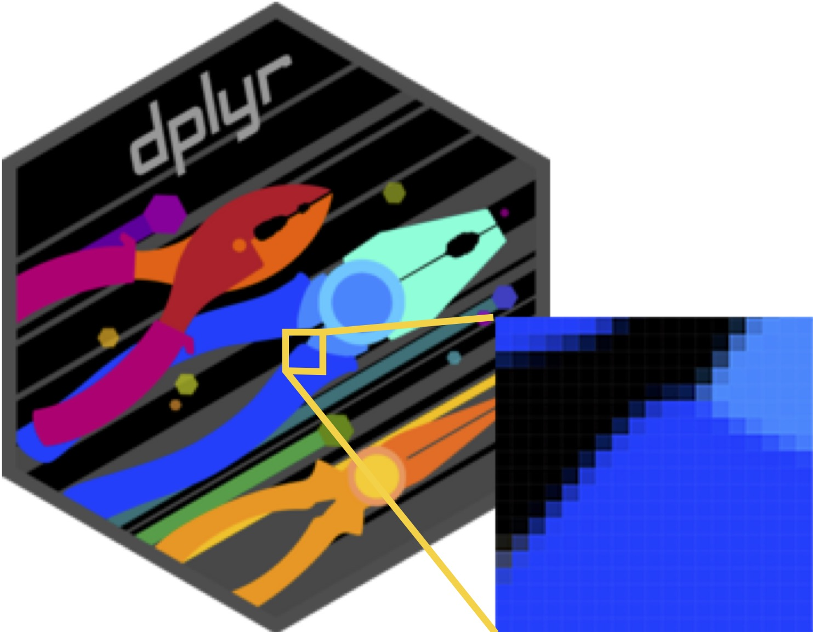
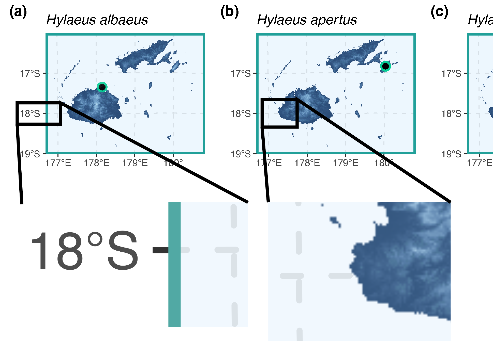

```{r libraryChunk, load-packages, include=FALSE}
# Markdown written by James B Dorey; contact jdorey@uow.edu.au (jbdorey@me.com) if help is needed.
# markdown packages
library(rmarkdown)
library(formatR)
library(styler)
library(kableExtra)

# Load core packages
library(dplyr)


matrix(runif(100), ncol = 20)
demonstratorVersion = FALSE

```

`r if(demonstratorVersion == TRUE){"\\\n\n**THIS IS A DEMONSTRATOR ONLY VERSION**\\\n"}`

```{r setSECRETRootPath, include=FALSE,  eval=TRUE}
  # Set the RootPath to your folder
RootPath <- tempdir()
  # You can then set this as the project's working directory. 
  # This is where R will first look to find 
  # or save data as a default
setwd(RootPath)
```

# GIS data basics

People are often quite intimidated by working with any data, let alone specialised datasets and formats! Even **Excell** data formats can be scary if you're so inclined. So, I'll try to dispell some of your fears in this section as even "complex" data can be demistified. Much of the data that we are going to be using isn't *actually* complex!

## Raster and vector data

Alright, so I know that I said our data weren't complex and then I threw two random and scary-sounding words at you. Well, don't stress I'll break it down and also point out that *raster* and *vector* data are also regularly used by most of us on a daily basis! In the shortest terms possible... *raster* data are matrices/tables of data and vector data are simply points and lines. 

### Raster data (matrices or tables)

One of the most-commonly known raster file formats would be the *.jpg* format. But, many others are commonly used, such as *.tiff*, *.png*, and *.gif*. You might be wondering "How on Earth is that a matrix or table??". And loo, fair enough. But take a look at the below dplyr logo. This is a *.png* file, and if we zoom in, we can start to see the pixels which are actualyl just cells of a matrix that are filled with colour! This logo has a resolution of 240x277 (66,480) pixels.



### Vector data (points and lines)

Vector data formats are even simpler, I think than raster data formats. Once again, you are all familiar with these formats! Probably the most-common one would be the *.pdf* format. But others exist like *.svg* and *.shp*. Vector file formats **do not have pixels** at all, which actually has some benefits. This means that we can keep zooming and zooming in on a vector file (just as we did above) and we will never see pixels! 

Below, you can see a cutout of a *.pdf* map file which has vector data (letters, numbers, points, and lines) as well as raster data embedded (a raster map of elevation). On the left hand side you can see that we can zoom into the 18ºS and the lines without any pixels appearing. But, on the right hand side, you cna see that the lines of the map remain clear but the pixels of the map begin to appear! 



## Projections

## *R* formats

### *sf* (formerly *sp*)

### *terra* (formerly *raster*)


# Read and plot data

## Points

## Vector

## Raster


# Simple analyses

## Extract data

### Vector

### Raster

## 


# What's coming next week?

Next week, we will be extending some of what we learnt here in order to read in GIS data, make some maps, and do some simple analyses.

# Packages used today

{width="200px"} 
{width="200px"}
{width="200px"} 
{width="200px"}

Plus the default R packages, **base** and **utils** 